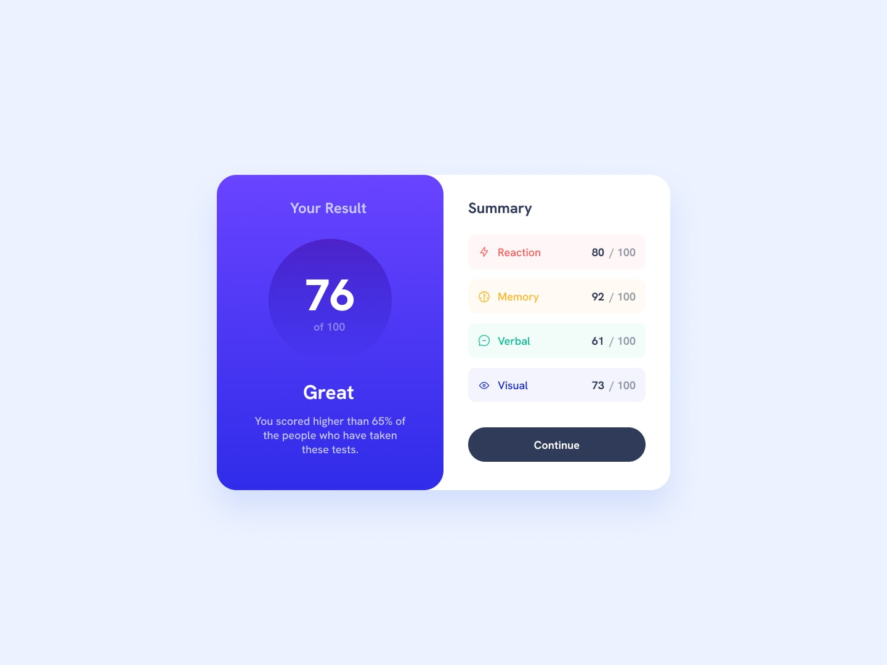

# Frontend Mentor - Results Summary Component



## Overview

This is my solution to the **Results Summary Component** challenge from [Frontend Mentor](https://www.frontendmentor.io/).

The goal of this challenge was to reproduce a results summary component from a provided design, including both desktop and mobile layouts.

The project focuses on strengthening fundamental **HTML and CSS** skills, with particular attention to Flexbox, responsive design, typography, spacing, colors, component positioning, and interactive states.

## Screenshot


## Links

* [Frontend Mentor](https://www.frontendmentor.io/profile/alexandre-delsol)
* [Live Site](https://alexandre-delsol.github.io/fm-04-results-summary/)
* [Repository](https://github.com/alexandre-delsol/fm-04-results-summary)

## Built With

* HTML5
* CSS3
* Flexbox
* Responsive Design
* CSS Positioning
* Git / GitHub

## Features

* Responsive results summary component
* Semantic HTML structure
* Flexbox-based layouts
* Desktop and mobile layouts
* Results list using semantic `<ul>` and `<li>` elements
* Custom typography using Hanken Grotesk
* Responsive spacing and sizing
* Hover state on the Continue button
* Overlapping cards using CSS positioning and `z-index`
* Custom colors and gradients based on the provided style guide

## What I Learned

This challenge helped me reinforce several fundamental CSS concepts and improve my ability to translate a visual design into a responsive layout.

### Flexbox

I practiced using Flexbox at several levels of the component.

The main component uses Flexbox to place the two cards side by side on larger screens:

```css
.score-component {
    display: flex;
}
```

The result card uses a vertical Flexbox layout to organize its content:

```css
.result-card {
    display: flex;
    flex-direction: column;
    justify-content: center;
    align-items: center;
}
```

This helped me better understand the relationship between the **main axis** and **cross axis** when changing `flex-direction`.

### Alignment

I also practiced the difference between:

* `justify-content`
* `align-items`
* `align-self`

For example, the summary card uses:

```css
align-items: flex-start;
```

while the Continue button can override the alignment of the other children with:

```css
align-self: center;
```

This reinforced the idea that `align-items` controls the alignment of flex children globally, while `align-self` allows an individual child to use a different alignment.

### CSS Positioning and z-index

One of the more interesting parts of this challenge was reproducing the visual overlap between the result card and the summary card.

The two cards are positioned next to each other, but the result card needs to visually appear above the summary card.

I used relative positioning together with `z-index`:

```css
.result-card {
    position: relative;
    z-index: 2;
}

.summary-card {
    position: relative;
    z-index: 1;
}
```

The important distinction is that `z-index` does not create the overlap itself. It controls the stacking order when elements occupy overlapping areas.

The actual visual displacement is handled separately.

On desktop, the result card is moved horizontally:

```css
transform: translateX(15px);
```

On mobile, the summary card is moved vertically:

```css
transform: translateY(-30px);
```

This allowed me to reproduce the different composition of the component between desktop and mobile layouts.

### Responsive Design

The desktop layout uses two cards placed horizontally:

```text
┌──────────────────┬──────────────────┐
│                  │                  │
│      Result      │     Summary      │
│                  │                  │
└──────────────────┴──────────────────┘
```

On smaller screens, the layout changes to a vertical composition:

```text
┌──────────────────┐
│                  │
│      Result      │
│                  │
└──────────────────┘
┌──────────────────┐
│     Summary      │
│                  │
└──────────────────┘
```

The layout direction is changed using a media query:

```css
@media (max-width: 600px) {
    .score-component {
        flex-direction: column;
    }
}
```

This helped reinforce the idea that responsive design is not simply about reducing dimensions. The **layout itself can change depending on the available space**.

### Box Model

I continued practicing the relationship between:

* `width`
* `height`
* `padding`
* `margin`
* `box-sizing`
* `gap`

I used:

```css
box-sizing: border-box;
```

through the reset so that declared dimensions include the element's padding and border.

I also used `gap` with Flexbox to control spacing between elements without relying unnecessarily on margins.

### Semantic HTML

The four result categories are represented as a list:

```html
<ul>
    <li>...</li>
    <li>...</li>
    <li>...</li>
    <li>...</li>
</ul>
```

Using `<ul>` and `<li>` is appropriate because the categories form a collection of related results.

I also used headings and paragraphs according to the role of the content rather than choosing elements purely for their visual appearance.

### Decorative Images

The category icons are decorative because their meaning is already provided by the adjacent text.

They therefore use an empty `alt` attribute:

```html

```

This prevents screen readers from unnecessarily reading redundant information.

## Continued Development

For future projects, I want to continue improving:

* Responsive CSS
* CSS layout techniques
* Accessibility
* Keyboard navigation and focus states
* Semantic HTML
* Typography
* CSS architecture and maintainability
* Git commit quality
* Component-based development

I also want to progressively introduce JavaScript and frontend frameworks into future Frontend Mentor challenges after consolidating my HTML and CSS fundamentals.

## Author

* Frontend Mentor - [@alexandre-delsol](https://www.frontendmentor.io/profile/alexandre-delsol)
* GitHub - [@alexandre-delsol](https://github.com/alexandre-delsol)
